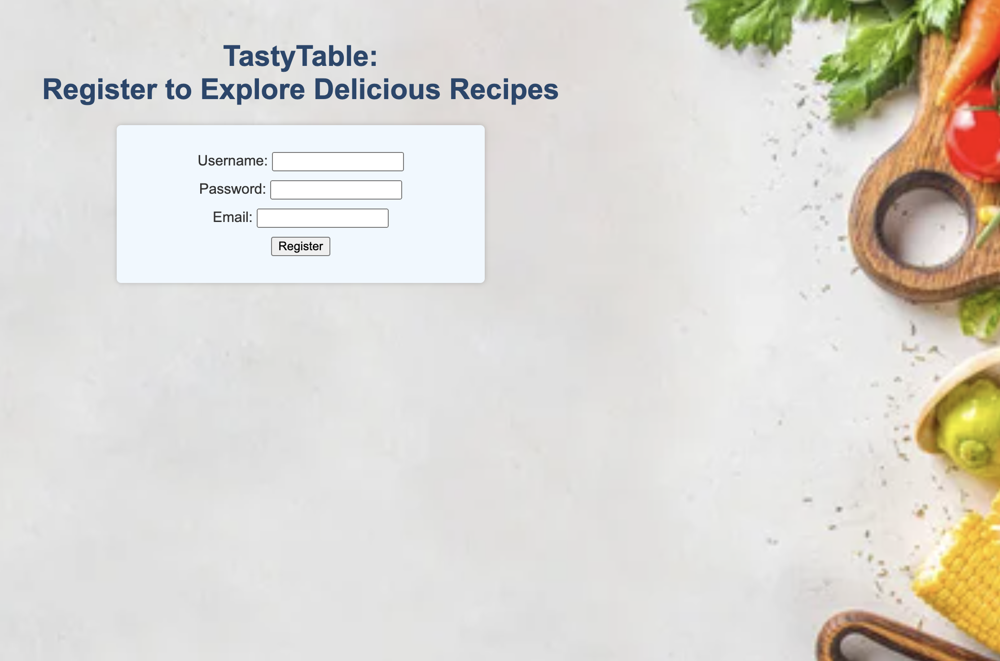
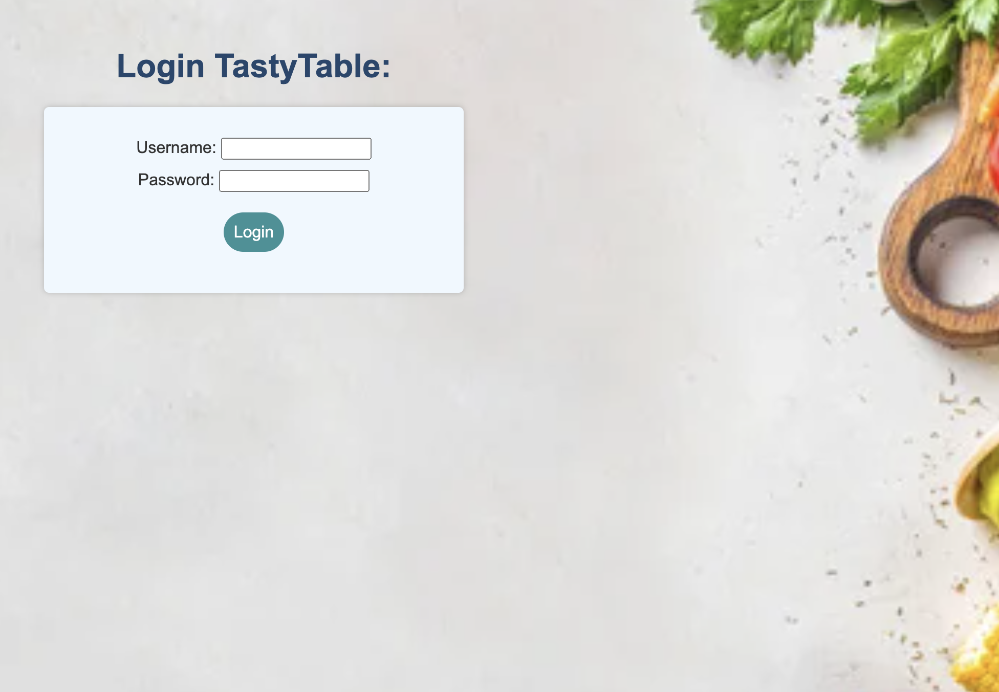
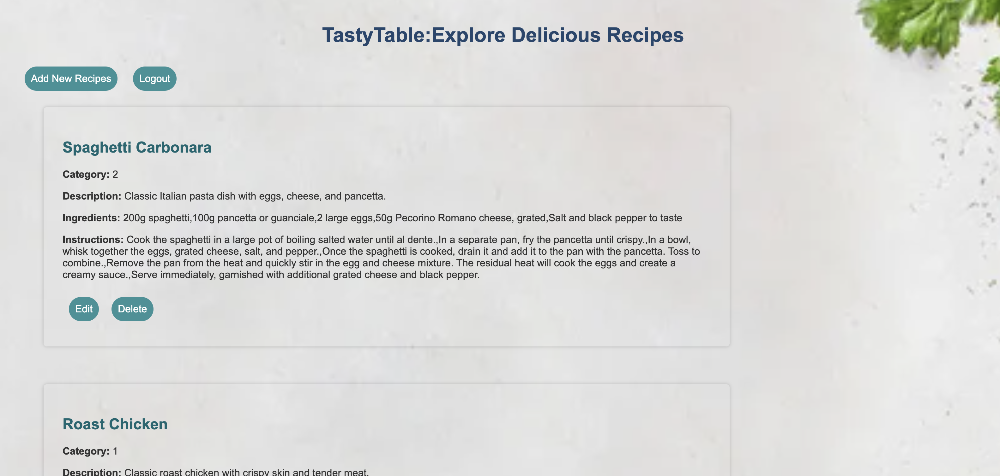

# TastyTable App
The TastyTable App is an application  that allows users to explore, create, edit, and delete recipes. 

## Features

- **User Authentication:** Users can create an account, log in, and log out.
- **Recipe Management:** Users can create, view, edit, and delete their recipes.
- **Category Filtering:** Recipes are categorized for easy browsing.

## Technologies Used

- **Node.js:** Backend server environment.
- **Express.js:** Web framework for building RESTful APIs.
- **EJS:** Templating engine for server-side rendering of views.
- **CSS:** Frontend design and layout.
- **JavaScript:** Client-side scripting for interactive features.
- **bcrypt:** Password hashing library for user authentication.

## Project Requirements

- **Custom Middleware:** Implemented at least two pieces of custom middleware.
- **Error Handling Middleware:** Utilized error-handling middleware.
- **Data Categories:** Implemented at least three different data categories: users, recipes, categories.
- **Data Structuring Practices:** Utilized reasonable data structuring practices.
- **GET Routes:** Created GET routes for all data that should be exposed to the client.
- **POST Routes:** Created POST routes for data, including client creation of recipes via a POST request.
- **PATCH or PUT Routes:** Implemented PATCH or PUT routes for data manipulation, including client manipulation of recipes via a PATCH or PUT request.
- **DELETE Routes:** Implemented DELETE routes for data deletion, including client deletion of recipes via a DELETE request.
- **Query Parameters:** Included query parameters for data filtering, where appropriate.
- **Route Parameters:** Utilized route parameters, where appropriate.
- **View Rendering:** Created and rendered at least one view using a view template and template engine.
- **CSS Styling:** Used simple CSS to style the rendered views.
- **Form Interaction:** Included a form within a rendered view that allows for interaction with the RESTful API.

## GitHub Repository Link 
https://github.com/Hrais12/SBA-Express-Server-Application